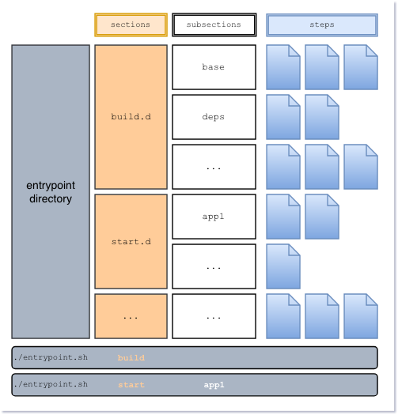

# Claranet PHP

Provides an opinionated, extensible PHP docker image build & run concept, which unifies common scenarios to build and run PHP applications / jobs in a container world.
It ships with default configurations for nginx and php-fpm, supports the most important configurations to be
set via environment variables and makes it easy to check external services (like a DBMS, cache, object-store) before proceeding with the container startup.

<!-- TOC -->

- [Claranet PHP](#claranet-php)
    - [TL;DR](#tldr)
    - [Build & Run Concept](#build--run-concept)
        - [Main Sections](#main-sections)
        - [Subsections](#subsections)
        - [Steps](#steps)
        - [Configure Sections](#configure-sections)
        - [Docker Image Builds](#docker-image-builds)
    - [Environment Variables](#environment-variables)
        - [Docker Build Arguments](#docker-build-arguments)
        - [General](#general)
        - [GCP](#gcp)
        - [OS](#os)
        - [Nginx](#nginx)
        - [NodeJS](#nodejs)
        - [PHP](#php)
        - [Mailing](#mailing)
    - [Configuration](#configuration)
        - [Nginx](#nginx-1)
        - [PHP](#php-1)
            - [Pre-compiled Modules](#pre-compiled-modules)
    - [Cronjobs](#cronjobs)
    - [Sending A Mail](#sending-a-mail)

<!-- /TOC -->

## TL;DR

* extends official docker php images
* provides generic build and life cycle infrastructure for containerized PHP applications (well prepared for kubernetes)
* shipped as PHP 7.1.x and 7.2.x flavor
* there is a (build>base already run / build>base only prepared) flavor for each PHP version
* general run concept: `docker run --rm -t claranet/php:1.1.18-php7.2.15 <main-section> [subsection] [subsection-args, ...]`
* overview: `docker run --rm -t claranet/php:1.1.18-php7.2.15 help`
* supplied services
    - nginx
    - phpfpm
    - crond

Build image locally:
```sh
# generates local/claranet/php:1.1.18-php7.2.15
./bin/image.sh build
```

## Build & Run Concept

**System requirements**: To be able to build this docker image, you need `docker`, `gettext` (envsubst) and the `bash`.

The concept is based on the good old `.d` directory concept from debian. There are 3 levels we need to discuss

1. main section
1. subsection
1. steps

A quick visual overview gives (see more details below) 

### Main Sections

A main section is collection of `subsections` which share an abstract topic. For example on default we provide the following
main sections by default:

* build
* start
* stop
* test

Main sections are identified by looking for a `.d` directory within `docker/`. The entrypoint is designed to look up
available main sections automatically. So you are able to introduce new main sections in your custom derivate of this
image by adding an additional `.d` directory.

To execute all subsections of a main section, you need to call the main section from `/entrypoint.sh`. So running all
build subsections is done by calling `/entrypoint.sh build`.

Note: not all main sections are able to run all subsections! (e.g. `start`). See [configure sections](#configure-sections)
for more details regarding this topic.

### Subsections

Each main section must have at least one subsection. Subsections exist in order to organize related, self-contained steps
(scripts). Subsections can be executed directly by specifying the subsection after the main section. So calling only
the subsection `base` from the main section `build`, you need to execute `/entrypoint.sh build base`.

Subsections are directories within a main section - naming doesn't matter!

Calling a subsection results in a execution of all steps contained in the subsection. Steps are executed in alphanumeric order.

Note: you can describe subsections in the `/entrypoint.sh help` by [configuring them](#configure-sections)

### Steps

**Context**

A step lives inside a subsection, so the hierarchy looks like `main section > subsection > step`. A step is represented in
form of a script. This script can be referenced by a symlink or live directly inside the subsection. Only bash scripts
are currently supported. A step will be sourced by the caller, which makes all functions / vars from previous steps and
`docker/*.inc.sh` files available to the script itself.

Each step current dir is set to `$WORKDIR` before executing the step.

**Shared steps**

Some steps are required in multiple subsections. To overcome the need of reimplementing / having duplicated steps
steps can be references via symlinks. The Claranet PHP image already makes use of this and provides a directory
called `docker/shared_steps/`. You can find scripts there, which will be referenced by multiple subsections.

_If you need a step in multiple subsections, please make use of this mechanism!_


### Configure Sections

Main sections and subsections share the same way how they can be configured. A section may contain a file named `META`.
If available, this file will be included by `/entrypoint.sh help` and in the run to iterate of all subsections 
(e.g. `/entrypoint.sh build`).

The help method uses the `SECTION_DESCRIPTION` to print more details about the available sections. In case of a main section
it will be able to print a multi line string - standing by it's own. In case of a subsection the content should be
kept short and one-line only - as it gets print after the subsection name.

`META` file schema:
```sh
# a one line description text which will be printed inside the help message
# Default: no description specified (see Configure Sections in documentation)
SECTION_DESCRIPTION="...your description..."

# AFFECT MAIN SECTIONS ONLY
# if false => requires the user to call a subsection directly
# and prohibits running all subsections by calling the main section only
# Default: true
CATCH_ALL_EXECUTION="<true|false>"
```

### Docker Image Builds

The docker image build is, despite the recommendation, outsourced in multiple shell scripts, living within the section `build`. The build process is split in at least 2 subsections (parts): `base` and `deps`. The user is able and encouraged to add custom subsections and overwrite or enhance current subsections.

**base**:

The subsection `base` prepares the image OS by...
* configure APT sources
* install APT packages (listed in `SYSTEM_PACKAGES` env var)
* install / compile PHP modules
* install / configure PHP composer
* install nodejs and npm
* install git and configure it to use HTTPS instead of SSH for cloning
* install the newrelic daemon / php module if `ENABLE_NEWRELIC` is set to `true`

If you are lucky, you shouldn't be required to run this subsection in your customized image.

In order to speed up the build process for images based on this one, we already run the `base` subsection while building this image. If you need a lot of customization, you might need to run the base subsection by your own - this is why we also provide a `-nobase` flavoured image! The `-nobase` flavour comes with all the prepared scripts from `build > base`, but those script haven't been executed yet.

However, you should run the `base` subsection before running any other subsection!

**deps**:

Deps is a prepared-only subsection. It is meant to install application specific dependencies like npm or composer packages; apply code patches or do any other task to make the application code runnable.

This subsection should be called by the depending custom docker image!


## Environment Variables

Checkout default values in the [Dockerfile](Dockerfile).

### Docker Build Arguments

To easy docker builds, we provide a few handy options here

| Name               | Default value   | Description                                                                     |
|--------------------|-----------------|---------------------------------------------------------------------------------|
| ERROR_EXIT_CODE    | 1               | Docker build RUN step error code on failure; handy for debugging                |
| ENABLE_CLEANUP     | true            | If true, prevents cache clearing, removing of build packages/download artifacts |
| ENABLE_GCP         | false           | Enable GCP optimizations (e.g. use GCP APT mirror)                              |
| RUN_BUILD_BASE     | true            | Switch to disable `build > base` for the `-nobase` flavoured image              |
| GITLAB_SERVER_NAME |                 | Normaly the content of `$CI_SERVER_NAME` in gitlab-ci jobs; `ONBUILD` only      |
| GITLAB_USER        | gitlab-ci-token | The token user to auth against gitlab; `ONBUILD` only                           |
| GITLAB_TOKEN       | emtpy           | The actual token to auth against gitlab; `ONBUILD` only                         |


### General

| Name           | Description                                          |
|----------------|------------------------------------------------------|
| WORKDIR        | Docker WORKDIR, exposed as env var to easy scripting |
| BUILD_LOG      | Path to the build log file                           |
| ENABLE_PATCHES | Enables/disables `deps > apply patches` step         |


### GCP

| Name                        | Description                                                     |
|-----------------------------|-----------------------------------------------------------------|
| ENABLE_GCP                  | If true, enables GCP optimizations                              |
| GOOGLE_ASSET_BUCKET_ENABLED | Enable bucket support in nginx                                  |
| ASSET_BUCKET_NAME           | The GCP Cloud Storage name, will be used for the nginx config   |
| ASSET_VERSION               | A string which indicates the asset version, e.g. the commit SHA |


### OS

| Name               | Description                                                                |
|--------------------|----------------------------------------------------------------------------|
| PATH               | OS PATH variable                                                           |
| BUILD_PACKAGES     | APT packages, removed by CLEANUP, if `ENABLE_CLEANUP` is `true`            |
| SYSTEM_PACKAGES    | APT packages                                                               |
| JESSIE_PACKAGE_MAP | Maps Debian stretch to jessie package names `<stretch-name>:<jessie-name>` |
| ENABLE_NEWRELIC   | If true, install the newrelic daemon + php module at build time (`base`)   |


### Nginx

Nginx does not support environment variables by itself (except if you enable the lua script support...). So we are using `envsubst` before enabling configs from `/etc/nginx/sites-available/*.conf`.

| Name                  | Description                                                            |
|-----------------------|------------------------------------------------------------------------|
| NGINX_SITES_AVAILABLE | Path to the `sites-available/` directory                               |
| NGINX_SITES_ENABLED   | Path to the `sites-enabled/` directory                                 |
| PHPFPM_HOST           | IP/Domain where to find the php-fpm fastcgi service                    |
| PHPFPM_PORT           | Port of the php-fpm fastcgi service                                    |
| DOCUMENT_ROOT         | Default document root for the default vhost                            |
| COMPRESS_FILE_MATCH   | Extended regex for matching files which should be compressed for nginx |
| COMPRESS_FILE_PATHS   | Where to look for files to be compressed during build time             |


### NodeJS

| Name               | Description                                                      |
|--------------------|------------------------------------------------------------------|
| ENABLE_NODEJS      | Install nodejs at build time `base`                              |
| NODEJS_VERSION     | Major version (e.g. `8` or `10`)                                 |
| ENABLE_BOWER       | Install bower at build time `deps`                               |
| NPM                | Name of the `npm` cli binary (`npm` or `yarn`)                   |
| NPM_BUILD_PACKAGES | APT packages to be able to compile packages at build time `deps` |
| NPM_ARGS           | Additional arguments for `$NPM install`                          |


### PHP

We are exposing most of the important `php.ini` settings via environment variables and
use the [ini-env-var substitution feature](http://php.net/manual/en/configuration.file.php) from PHP for that.

| Name                                | Description                                                                       |
|-------------------------------------|-----------------------------------------------------------------------------------|
| PHP                                 | The PHP binary name                                                               |
| FPM                                 | The PHP-FPM binary name                                                           |
| NEWRELIC_PHP_VERSION                | The newrelic php module package version, only useful, if  ENABLE_NEWRELIC is true |
| PHP_EXTENSIONS_STARTUP_ONLY         | A list of modules which shouldn't be enabled at build time                        |
| PHP_EXTENSIONS_STARTUP_ENABLE       | A list of modules, which should get enabled at container startup                  |
| PHP_EXTENSIONS                      | List of modules which should get compiled at build time (build base)              |
| PHP_BUILD_PACKAGES                  | APT packages required to compile extensions                                       |
| PHP_INI_DIR                         | Where to look for and store php ini files?                                        |
| PHP_INI_ALLOW_URL_FOPEN             | PHP ini _allow_url_fopen_ value                                                   |
| PHP_INI_DATE_TIMEZONE               | PHP ini _date.timezone_ value                                                     |
| PHP_INI_INCLUDE_PATH                | PHP ini _include\_path_ value                                                     |
| PHP_INI_MAX_EXECUTION_TIME          | PHP ini _max\_execution\_time_ value                                              |
| PHP_INI_MAX_INPUT_TIME              | PHP ini _max\_input\_time_ value                                                  |
| PHP_INI_MAX_INPUT_VARS              | PHP ini _max\_input\_vars_ value                                                  |
| PHP_INI_MEMORY_LIMIT                | PHP ini _memory\_limit_ value                                                     |
| PHP_INI_ERROR_LOG                   | PHP ini _error\_log_ value                                                        |
| PHP_INI_POST_MAX_SIZE               | PHP ini _post\_max\_size_ value                                                   |
| PHP_INI_APC_ENABLED                 | PHP ini _apc\_enabled_ value                                                      |
| PHP_INI_APC_SHM_SIZE                | PHP ini _apc\_shm\_size_ value                                                    |
| PHP_INI_OPCACHE_ENABLE              | PHP ini _opcache\_enable_ value                                                   |
| PHP_INI_OPCACHE_ENABLE_CLI          | PHP ini _opcache\_enable\_cli_ value                                              |
| PHP_INI_OPCACHE_MEMORY_CONSUMPTION  | PHP ini _opcache\_memory\_consumption_ value                                      |
| PHP_INI_OPCACHE_VALIDATE_TIMESTAMPS | PHP ini _opcache\_validate\_timestamps_ value                                     |
| PHP_INI_FILE_UPLOADS                | PHP ini _file\_uploads_ value                                                     |
| PHP_INI_UPLOAD_MAX_FILESIZE         | PHP ini _upload\_max\_filesize_ value                                             |
| PHP_INI_MAX_FILE_UPLOADS            | PHP ini _max\_file\_uploads_ value                                                |
| PHP_INI_SHORT_OPEN_TAG              | PHP ini __short_open_tag_                                                         |
| PHP_INI_NEWRELIC_APPNAME            | PHP ini _newrelic\_appname_ value                                                 |
| PHP_INI_NEWRELIC_FRAMEWORK          | PHP ini _newrelic\_framework_ value                                               |
| PHP_INI_NEWRELIC_LICENSE            | PHP ini _newrelic\_license_ value                                                 |
| BLACKFIRE_AGENT                     | URL of the blackfire agent                                                        |
| CONSOLE                             | Composer console command name                                                     |
| CODECEPT                            | The codeception cli command name (with path)                                      |
| CODECEPTION_ARGS                    | Args which should get added to the codeception cli command name                   |
| COMPOSER_VERSION                    | Specify the composer version, which gets installed in `build > base`              |
| COMPOSER_ARGS                       | Additional `composer install` arguments, passed in `build > deps` subsection      |
| COMPOSER_DUMP_ARGS                  | Args applied to the `composer autodump` command                                   |


### Mailing

| Name             | Description                                                      |
|------------------|------------------------------------------------------------------|
| ENABLE_SMTP      | Enable / Disable ssmtp configuration and therefor mailing        |
| SMTP_ENCRYPTION  | Connection encryption used, e.g. `tls` (is STARTTLS) or `ssl`    |
| SMTP_AUTH_METHOD | Method used to authenticate against the SMTP server e.g. `login` |
| SMTP_HOST        | IP or domain of the SMTP service                                 |
| SMTP_PORT        | Port of the SMTP service                                         |
| SMTP_USERNAME    | Username used in conjunction with `SMTP_AUTH_METHOD`             |
| SMTP_PASSWORD    | Password used in conjunction with `SMTP_AUTH_METHOD`             |
| SMTP_TIMEOUT     | Connection timeout for established SMTP service connections      |


## Configuration

### Nginx

* uses filesystem meta information cache
* configurable via `DOCUMENT_ROOT`, `PHPFPM_HOST` and `PHPFPM_PORT` environment variables

### PHP

**php-fpm**

The php-fpm configuration is designed to match a generic pattern - optimized to leverage the usual load
per container. Normally you shouldn't be required to change the fpm configuration at all - if your container
needs to handle more requests, launch another one and balance the traffic.substitute

If you still need to extend the php-fpm config - the `start > phpfpm` subsection is prepared to launch different
fpm pools. To launch e.g. a pool named `wordpress`, after you added the pools config to the container:
`/entrypoint.sh start phpfpm wordpress`

It will start the `default` phpfpm pool if no other pool name is given.

NOTE: On default, OPCACHE is enabled and won't revalidate filesystem changes.

**php.ini**

In order to allow PHP config customization, this image uses the PHP ini parsers ability to substitute ENV
vars for ini values. See [available PHP env vars](#php) for more details.

#### Pre-compiled Modules

A list of module, coming with this docker image:

| Name      | Source | Enabled |
|-----------|--------|---------|
| bcmath    | core   | yes     |
| bz2       | core   | yes     |
| gd        | core   | yes     |
| gmp       | core   | yes     |
| intl      | core   | yes     |
| json      | core   | yes     |
| mbstring  | core   | yes     |
| opcache   | core   | yes     |
| dom       | core   | yes     |
| curl      | core   | yes     |
| pgsql     | core   | yes     |
| pdo_pgsql | core   | yes     |
| mysqlnd   | core   | yes     |
| pdo_mysql | core   | yes     |
| ldap      | core   | yes     |
| soap      | core   | yes     |
| zip       | core   | yes     |
| xdebug    | pecl   | no      |
| imagick   | pecl   | no      |
| redis     | pecl   | no      |
| APCu      | pecl   | no      |

## Cronjobs

To overcome the vixie-cron (debian default) environment variables issue (they are not propagated to launched cron-jobs), this image uses busybox' crond.

Cronjobs can be configured in the [docker/etc/cron.d](docker/etc/cron.d) directory. You can put there a file per username (e.g. named _root_) with cronjob entries based on the normal cron config syntax and `COPY` those files via your `Dockerfile` to `/etc/cron.d/` within the image.

```
# Cron config syntax
# m h   dom mon dow  command
  * *   *   *   *    mytask
```

Those files will be linked to `/var/spool/cron/crontabs/` when `start > crond` gets executed.

## Sending A Mail

Mailing via CLI is an easy topic with this image. Set `ENABLE_SMTP` to `true` and ssmtp will be pre-configured on the `start` subsections `crond`, `pre-deployment` and `post-deployment`. After that, you can use the `ssmtp` tool to send your mails synchronously.

For example:
```sh
ssmtp to@local <<EOF
To: to@local
From: from@local
Subject: [claranet] This is a nice mail

Helo,

from CLI

Regards,
Me - the CLI
EOF
```
